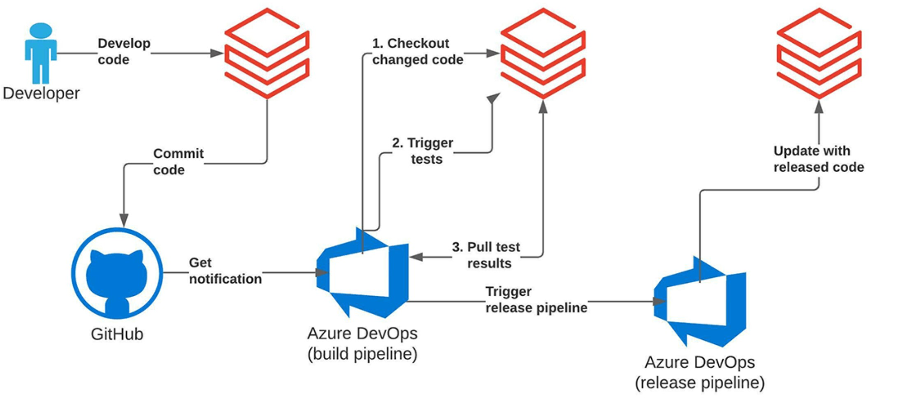
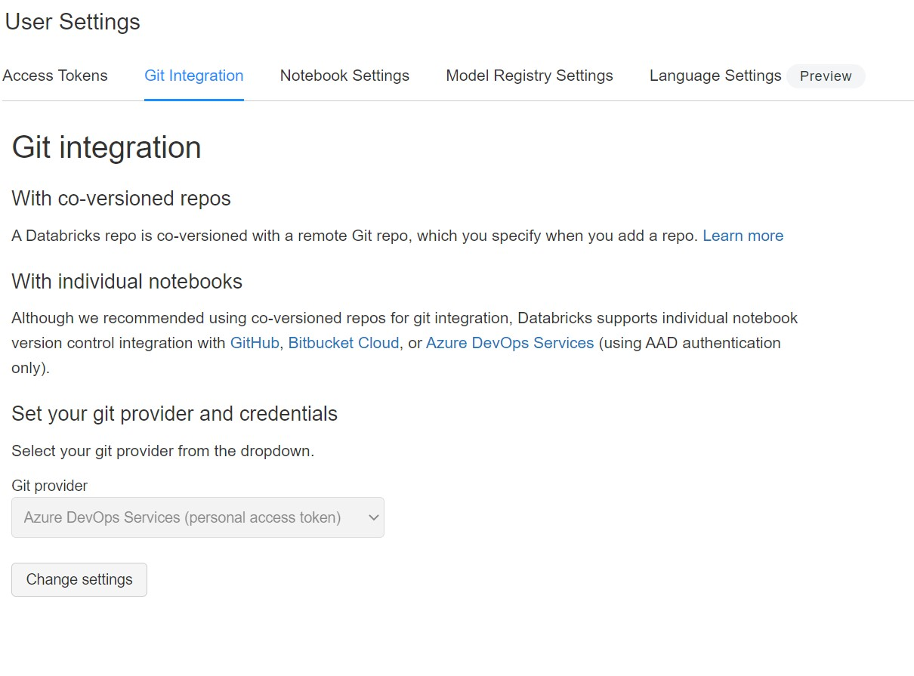
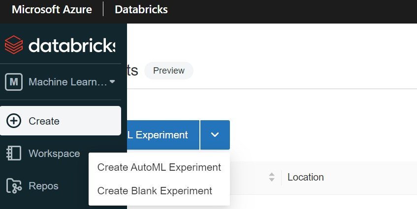

# MLOps with  Databricks and Azure DevOps
## How to implement MLOps using Databricks Repos APIs and Azure DevOps

This repo implements MLOPs using [Azure Databricks](https://azure.microsoft.com/en-us/services/databricks/),
 [Databricks Repos API](https://docs.microsoft.com/en-us/azure/databricks/repos), 
[MLFlow](http://mlflow.org), and [Azure DevOps](https://docs.microsoft.com/en-us/azure/devops/user-guide/what-is-azure-devops?view=azure-devops)

The Databricks Repos API provides repository-level integration with Git providers ( here looking at the case of Azure DevOps provider) & allows us to update a repo (Git project checked out as repo in Databricks) 
to the latest version of a specific git branch.

According to this MLOPs workflow developers can code individual features in a feature branch and test using unit tests (e.g., implemented notebooks).
CI/CD pipelines on Azure DevOps use Databricks Repos API to sync updates of the latest code version.
CI/CD pipeline triggers  integration test job via the [Jobs API](https://docs.microsoft.com/en-us/azure/databricks/dev-tools/api/2.0/jobs).

# How to deploy this project 

You will need the following resources to get started:

## Azure Databricks Workspace

In your Azure subsciption,  [create an Azure Databricks workspace](https://docs.azuredatabricks.net/getting-started/try-databricks.html#step-2-create-a-databricks-workspace) on its own resource group.

## Import This DevOps Project

In Azure DevOps,  [create a project](https://docs.microsoft.com/en-us/azure/devops/user-guide/sign-up-invite-teammates?view=azure-devops#create-a-project) to host your MLOps pipeline. Import the code to your DevOps repo.

## Create Variable Group 
In Azure DevOps Library create a new variable group named **Databricks-mlops-environment**.
Add the variables:
- DATABRICKS_HOST = your Databricks host url 
- DATABRICKS_TOKEN = token generated in Databricks user settings -> Access Tokens 

## Create Personal Access Token 
Currently Azure Devops permissions to the Databricks Repos API is  supported via  Personal Access Tokens. 
Generate a [PAT in Azure Devops](https://docs.microsoft.com/en-us/azure/devops/organizations/accounts/use-personal-access-tokens-to-authenticate?view=azure-devops&tabs=preview-page) and use it in Databricks Git Integration under User Settings 

## Create a Databricks Experiment
Create a Blank Experiment and copy the Experiment ID to  [config.py](utils/config.py)

## Update your git provider e-mail in the code

Update the ***repo_path*** & ***unittest_notebook_path*** with your git provider username in [deploy.py](deploy/deploy.py) to connect to your Repos API.
Update the ***git_url*** with the url to your Azure DevOps repo in [deploy.py](deploy/deploy.py) to sync Repos API.

#### Set up The Build Pipeline

Use the  [azure-pipelines.yml](./azure-pipelines.yml) file to create & run your  Build Pipeline.

_Disclaimer:_ This work is adapting for Azure ( Git provider & compute)  the work done by Michael Shtelma and Piotr Majer in the blog post [ Implementing CI/CD on Databricks Using Databricks Notebooks and Azure DevOps](https://databricks.com/blog/2021/09/20/part-1-implementing-ci-cd-on-databricks-using-databricks-notebooks-and-azure-devops.html)

